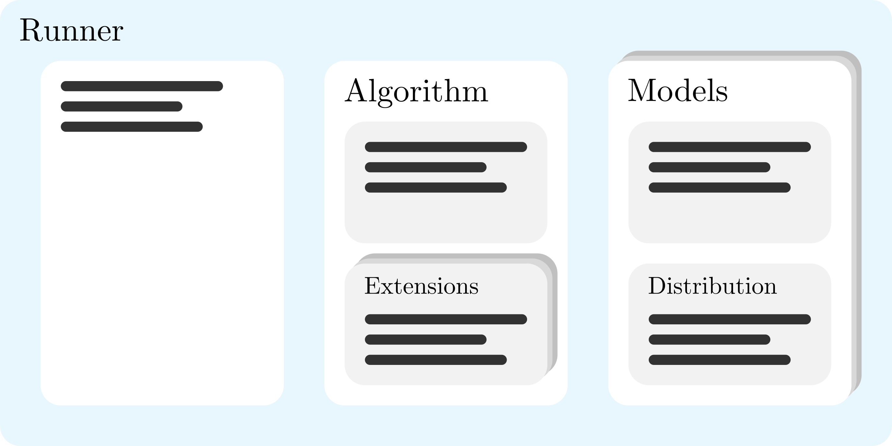
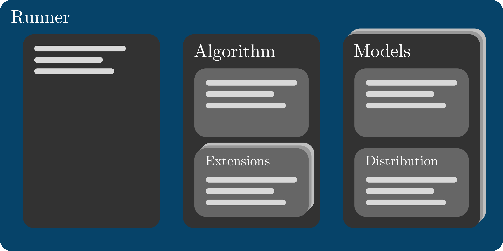

Configuration
=============

RSL-RL is configured with a dictionary that is passed to RSL-RL's runner during initialization. The dictionary is
usually read from a YAML file or constructed from Python dataclasses, such as in 
`Isaac Lab <https://github.com/isaac-sim/IsaacLab/blob/main/source/isaaclab_rl/isaaclab_rl/rsl_rl/rl_cfg.py>`__. 
It is nested to reflect the structure of the library, and follows this pattern:

The top level represents the runner configuration, which is composed of general settings and configuration dictionaries
for the algorithm (e.g. PPO), as well as for the models used by the algorithm (e.g. actor and critic). The algorithm 
dictionary contains the parameters of the algorithm, and may contain one or more configuration dictionaries for 
extensions. The model dictionaries contain the parameters of the models, and may contain a configuration dictionary for 
a distribution. 

In the following sections, we list the available settings for each configuration component, provide a minimal
:ref:`example configuration in YAML format <example-configuration>`, and explain how
:ref:`observations are configured <observation-configuration>`.

.. _runner-configuration:

Runner Configuration
--------------------

Currently, RSL-RL implements two runner classes:
:class:`~rsl_rl.runners.on_policy_runner.OnPolicyRunner` and
:class:`~rsl_rl.runners.distillation_runner.DistillationRunner`. The 
:class:`~rsl_rl.runners.on_policy_runner.OnPolicyRunner` is configured as follows:

.. list-table::
   :header-rows: 1
   :class: no-wrap-type-column

   * - Key
     - Type
     - Default
     - Description
   * - ``num_steps_per_env``
     - int
     - required
     - Number of environment steps collected per iteration.
   * - ``obs_groups``
     - dict[str, list[str]]
     - required
     - Mapping from observation sets to observation tensors coming from the environment.
   * - ``run_name``
     - str
     - missing
     - Optional run label shown in the console output.
   * - ``save_interval``
     - int
     - required
     - Number of iterations between checkpoints.
   * - ``logger``
     - str
     - ``"tensorboard"``
     - Logging service to use. Valid values: ``"tensorboard"``, ``"wandb"``, ``"neptune"``.
   * - ``wandb_project``
     - str
     - required for W&B
     - W&B project name used by the W&B writer.
   * - ``neptune_project``
     - str
     - required for Neptune
     - Neptune project name used by the Neptune writer.
   * - ``algorithm``
     - dict
     - required
     - RL algorithm configuration.
   * - ``actor``
     - dict
     - required
     - Actor model configuration.
   * - ``critic``
     - dict
     - required
     - Critic model configuration.

For the :class:`~rsl_rl.runners.distillation_runner.DistillationRunner`, the ``actor`` and ``critic`` keys are simply
replaced by ``student`` and ``teacher`` keys, respectively:

.. list-table::
   :header-rows: 1
   :class: no-wrap-type-column

   * - Key
     - Type
     - Default
     - Description
   * - ...
     - ...
     - ...
     - ...
   * - ``student``
     - dict
     - required
     - Student model configuration.
   * - ``teacher``
     - dict
     - required
     - Teacher model configuration.

Algorithm Configuration
-----------------------

RSL-RL implements two algorithms, :class:`~rsl_rl.algorithms.ppo.PPO` and
:class:`~rsl_rl.algorithms.distillation.Distillation`, which are configured as follows.

PPO
^^^

.. list-table::
   :header-rows: 1
   :class: no-wrap-type-column

   * - Key
     - Type
     - Default
     - Description
   * - ``class_name``
     - str
     - required
     - Algorithm class name. Valid values: ``"PPO"``.
   * - ``optimizer``
     - str
     - ``"adam"``
     - Optimizer used for policy/value updates. Valid values: see :func:`~rsl_rl.utils.utils.resolve_optimizer`.
   * - ``learning_rate``
     - float
     - ``0.001``
     - Optimizer learning rate.
   * - ``num_learning_epochs``
     - int
     - ``5``
     - Number of optimization epochs per iteration.
   * - ``num_mini_batches``
     - int
     - ``4``
     - Number of mini-batches per iteration.
   * - ``schedule``
     - str
     - ``"adaptive"``
     - Learning-rate schedule. Valid values: ``"adaptive"``, ``"fixed"``.
   * - ``value_loss_coef``
     - float
     - ``1.0``
     - Coefficient for the value-function loss.
   * - ``clip_param``
     - float
     - ``0.2``
     - PPO clipping parameter for surrogate/value clipping.
   * - ``use_clipped_value_loss``
     - bool
     - ``True``
     - Whether to clip the value loss.
   * - ``desired_kl``
     - float
     - ``0.01``
     - Target KL divergence used by the adaptive learning-rate schedule.
   * - ``entropy_coef``
     - float
     - ``0.01``
     - Entropy regularization coefficient.
   * - ``gamma``
     - float
     - ``0.99``
     - Discount factor.
   * - ``lam``
     - float
     - ``0.95``
     - GAE lambda parameter.
   * - ``max_grad_norm``
     - float
     - ``1.0``
     - Maximum gradient norm for gradient clipping.
   * - ``normalize_advantage_per_mini_batch``
     - bool
     - ``False``
     - Whether to normalize advantages for each mini-batch instead of across the entire rollout.
   * - ``share_cnn_encoders``
     - bool
     - ``False``
     - Whether to share the CNN networks between actor and critic in case
       the :class:`~rsl_rl.models.cnn_model.CNNModel` is used.
   * - ``rnd_cfg``
     - dict | None
     - ``None``
     - Optional RND extension configuration.
   * - ``symmetry_cfg``
     - dict | None
     - ``None``
     - Optional symmetry extension configuration.

Distillation
^^^^^^^^^^^^

.. list-table::
   :header-rows: 1
   :class: no-wrap-type-column

   * - Key
     - Type
     - Default
     - Description
   * - ``class_name``
     - str
     - required
     - Algorithm class name. Valid values: ``"Distillation"``.
   * - ``optimizer``
     - str
     - ``"adam"``
     - Optimizer used for student updates. Valid values: see :func:`~rsl_rl.utils.utils.resolve_optimizer`.
   * - ``learning_rate``
     - float
     - ``1e-3``
     - Optimizer learning rate.
   * - ``num_learning_epochs``
     - int
     - ``1``
     - Number of optimization epochs per iteration.
   * - ``gradient_length``
     - int
     - ``15``
     - Gradient backpropagation length.
   * - ``max_grad_norm``
     - float | None
     - ``None``
     - Maximum gradient norm for gradient clipping.
   * - ``loss_type``
     - str
     - ``"mse"``
     - Loss type. Valid values: ``"mse"``, ``"huber"``.

Model Configuration
-------------------

Different algorithms use models for different purposes. For example, :class:`~rsl_rl.algorithms.ppo.PPO` uses an actor
and a critic, while :class:`~rsl_rl.algorithms.distillation.Distillation` uses a student and a teacher. Even though
their function might be different, they can all use the same underlying model classes. RSL-RL currently implements
three different models: :class:`~rsl_rl.models.mlp_model.MLPModel`, :class:`~rsl_rl.models.rnn_model.RNNModel`, and
:class:`~rsl_rl.models.cnn_model.CNNModel`, which are configured as follows.

MLPModel
^^^^^^^^

.. list-table::
   :header-rows: 1
   :class: no-wrap-type-column

   * - Key
     - Type
     - Default
     - Description
   * - ``class_name``
     - str
     - required
     - Model class name. Valid values: ``"MLPModel"``.
   * - ``hidden_dims``
     - tuple[int] | list[int]
     - ``[256, 256, 256]``
     - Hidden dimensions of the MLP.
   * - ``activation``
     - str
     - ``"elu"``
     - Activation function of the MLP. Valid values: see :func:`~rsl_rl.utils.utils.resolve_nn_activation`.
   * - ``obs_normalization``
     - bool
     - ``False``
     - Whether to normalize the observations before passing them to the MLP.
   * - ``distribution_cfg``
     - dict | None
     - ``None``
     - Optional output distribution configuration. If provided, the model can output stochastic values sampled from 
       the distribution.

The  ``distribution_cfg`` dictionary contains all parameters required by a specific distribution. RSL-RL implements two
distributions by default: A simple Gaussian distribution (:class:`~rsl_rl.modules.distribution.GaussianDistribution`) 
and a Gaussian distribution with state-dependent standard deviation 
(:class:`~rsl_rl.modules.distribution.HeteroscedasticGaussianDistribution`). Both require the same parameters:

.. list-table::
   :header-rows: 1
   :class: no-wrap-type-column

   * - Key
     - Type
     - Default
     - Description
   * - ``class_name``
     - str
     - required
     - Distribution class name. Valid values: ``"GaussianDistribution"``, ``"HeteroscedasticGaussianDistribution"``.
   * - ``init_std``
     - float
     - ``1.0``
     - Initial standard deviation.
   * - ``std_type``
     - str
     - ``"scalar"``
     - Parameterization of the standard deviation. Valid values: ``"scalar"``, ``"log"``.

RNNModel
^^^^^^^^

The :class:`~rsl_rl.models.rnn_model.RNNModel` inherits from the :class:`~rsl_rl.models.mlp_model.MLPModel` and thus
shares the same configuration keys as the :class:`~rsl_rl.models.mlp_model.MLPModel`, with the addition of the following 
keys:

.. list-table::
   :header-rows: 1
   :class: no-wrap-type-column

   * - Key
     - Type
     - Default
     - Description
   * - ``class_name``
     - str
     - required
     - Model class name. Valid values: ``"RNNModel"``.
   * - ...
     - ...
     - ...
     - ...
   * - ``rnn_type``
     - str
     - ``"lstm"``
     - Type of RNN network. Valid values: ``"lstm"``, ``"gru"``.
   * - ``rnn_hidden_dim``
     - int
     - ``256``
     - Hidden dimension of the RNN.
   * - ``rnn_num_layers``
     - int
     - ``1``
     - Number of RNN layers.
  
CNNModel
^^^^^^^^

The :class:`~rsl_rl.models.cnn_model.CNNModel` inherits from the :class:`~rsl_rl.models.mlp_model.MLPModel` and thus
shares the same configuration keys as the :class:`~rsl_rl.models.mlp_model.MLPModel`, with the addition of the following 
keys:

.. list-table::
   :header-rows: 1
   :class: no-wrap-type-column

   * - Key
     - Type
     - Default
     - Description
   * - ``class_name``
     - str
     - required
     - Model class name. Valid values: ``"CNNModel"``.
   * - ...
     - ...
     - ...
     - ...
   * - ``cnn_cfg``
     - dict[str, dict] | dict[str, Any] | None
     - ``None``
     - Configuration of the CNN encoder(s).

Instead of directly passing the CNN parameters to the :class:`~rsl_rl.models.cnn_model.CNNModel` (similar to how it is 
done for the :class:`~rsl_rl.models.mlp_model.MLPModel` and :class:`~rsl_rl.models.rnn_model.RNNModel`), the parameters 
are grouped in a dictionary ``cnn_cfg``. This enables passing multiple CNN configurations for different observations 
(e.g. different cameras). If only one CNN is needed or all CNNs have the same configuration, the dictionary may directly 
contain the CNN parameters. If multiple CNNs with different configurations are needed, the dictionary must contain a 
dictionary for each CNN configuration, with the key being the observation the configuration applies to. The 
:class:`~rsl_rl.models.cnn_model.CNNModel` will then create CNNs based on the provided configurations. A CNN
configuration includes the following parameters:

.. list-table::
   :header-rows: 1
   :class: no-wrap-type-column

   * - Key
     - Type
     - Default
     - Description
   * - ``output_channels``
     - tuple[int] | list[int]
     - required
     - Output channels for each convolutional layer.
   * - ``kernel_size``
     - int | tuple[int] | list[int]
     - required
     - Kernel size for each convolutional layer or a single kernel size for all layers.
   * - ``stride``
     - int | tuple[int] | list[int]
     - ``1``
     - Stride for each convolutional layer or a single stride for all layers.
   * - ``dilation``
     - int | tuple[int] | list[int]
     - ``1``
     - Dilation for each convolutional layer or a single dilation for all layers.
   * - ``padding``
     - str
     - ``"none"``
     - Padding type to use. Valid values: ``"none"``, ``"zeros"``, ``"reflect"``, ``"replicate"``, ``"circular"``.
   * - ``norm``
     - str | tuple[str] | list[str]
     - ``"none"``
     - Normalization type for each convolutional layer or a single normalization type for all layers. Valid values: 
       ``"none"``, ``"batch"``, ``"layer"``.
   * - ``activation``
     - str
     - ``"elu"``
     - Activation function to use. Valid values: see :func:`~rsl_rl.utils.utils.resolve_nn_activation`.
   * - ``max_pool``
     - bool | tuple[bool] | list[bool]
     - ``False``
     - Whether to apply max pooling after each convolutional layer or a single boolean for all layers.
   * - ``global_pool``
     - str
     - ``"none"``
     - Global pooling type to apply at the end. Valid values: ``"none"``, ``"max"``, ``"avg"``.
   * - ``flatten``
     - bool
     - ``True``
     - Whether to flatten the output tensor.

Extension Configuration
-----------------------

RSL-RL currently features two extensions for :class:`~rsl_rl.algorithms.ppo.PPO`. Those are
:class:`~rsl_rl.extensions.rnd.RandomNetworkDistillation` and :class:`Symmetry`, which may be configured as follows.

Random Network Distillation
^^^^^^^^^^^^^^^^^^^^^^^^^^^

.. list-table::
   :header-rows: 1
   :class: no-wrap-type-column

   * - Key
     - Type
     - Default
     - Description
   * - ``weight``
     - float
     - ``0.0``
     - Initial weight of the RND reward.
   * - ``weight_schedule``
     - dict | None
     - ``None``
     - Weight schedule for the RND reward. Valid values: see :class:`~rsl_rl.extensions.rnd.RandomNetworkDistillation`.
   * - ``learning_rate``
     - float
     - ``0.001``
     - Learning rate for the RND optimizer.
   * - ``predictor_hidden_dims``
     - tuple[int] | list[int]
     - required
     - Hidden dimensions of the RND predictor network.
   * - ``target_hidden_dims``
     - tuple[int] | list[int]
     - required
     - Hidden dimensions of the RND target network.
   * - ``num_outputs``
     - int
     - required
     - Number of outputs of the RND networks.
   * - ``activation``
     - str
     - ``"elu"``
     - Activation function for the RND networks. Valid values: see :func:`~rsl_rl.utils.utils.resolve_nn_activation`.
   * - ``state_normalization``
     - bool
     - ``False``
     - Whether to normalize the RND state.
   * - ``reward_normalization``
     - bool
     - ``False``
     - Whether to normalize the RND reward.

Symmetry Augmentation
^^^^^^^^^^^^^^^^^^^^^

.. list-table::
   :header-rows: 1
   :class: no-wrap-type-column

   * - Key
     - Type
     - Default
     - Description
   * - ``use_data_augmentation``
     - bool
     - required
     - Whether to add symmetric trajectories to the batch.
   * - ``data_augmentation_func``
     - str | callable | None
     - required
     - Function to generate symmetric trajectories. Resolved using :func:`~rsl_rl.utils.utils.resolve_callable`.
   * - ``use_mirror_loss``
     - bool
     - required
     - Whether to add a symmetry loss term to the loss function.
   * - ``mirror_loss_coeff``
     - float
     - required
     - Coefficient for the symmetry loss.

.. _example-configuration:

Example Configuration
---------------------

While the previous sections make it seem rather complicated to set up a configuration, the required configuration to run 
a training with, e.g., :class:`~rsl_rl.algorithms.ppo.PPO` is actually quite simple. The following configuration is
already sufficient:

.. code-block:: yaml

   runner:
     num_steps_per_env: 24
     obs_groups: {"actor": ["policy"], "critic": ["policy", "privileged"]}
     save_interval: 100
     algorithm:
       class_name: PPO
     actor:
       class_name: MLPModel
       distribution_cfg:
         class_name: GaussianDistribution
     critic:
       class_name: MLPModel

.. _observation-configuration:

Observation Configuration
-------------------------

RSL-RL expects the :func:`~rsl_rl.env.vec_env.VecEnv.step` method of the environment to return observations as a 
:class:`~tensordict.tensordict.TensorDict`. This dictionary contains one or more tensors with observation data, referred 
to as *observation groups* in RSL-RL and Isaac Lab.

The ``obs_groups`` dictionary of the :ref:`runner configuration <runner-configuration>` defines which observation groups
are used for which purpose. Each purpose defines its own *observation set*, which is simply a list of observation 
groups. In other words, the ``obs_groups`` dictionary maps from *observation sets* to lists of *observation groups*.

As the above definition is quite abstract, let's consider a simple example for a
:class:`~rsl_rl.algorithms.ppo.PPO` training. The :func:`~rsl_rl.env.vec_env.VecEnv.step` method of our environment 
might return the following observations:

.. code-block:: python

  obs = TensorDict(
    {
      "policy": torch.tensor([1.0, 2.0, 3.0]), # available during robot deployment
      "privileged": torch.tensor([4.0, 5.0, 6.0]), # only available during training
    }
  )

Let's assume the "policy" observation group is meant for both actor and critic. The "privileged" observation group is 
only available during training and therefore cannot be used by the actor model, but may still improve learning 
performance when passed to the critic. Thus, the ``obs_groups`` dictionary would be configured as follows:

.. code-block:: yaml

   obs_groups: {"actor": ["policy"], "critic": ["policy", "privileged"]}

With this configuration, the actor would receive the "policy" tensor as input, while the critic would receive both the 
"policy" and the "privileged" tensor as input. 

Depending on the algorithm and extensions used, RSL-RL expects different observation sets to be present in the 
``obs_groups`` dictionary. Currently, the following observation sets may be required, depending on the configuration:

.. list-table::
   :header-rows: 1
   :class: no-wrap-type-column

   * - Key
     - Description
   * - ``actor``
     - Observations used as input to the actor model.
   * - ``critic``
     - Observations used as input to the critic model.
   * - ``student``
     - Observations used as input to the student model.
   * - ``teacher``
     - Observations used as input to the teacher model.
   * - ``rnd_state``
     - Observations used as input to the RND extension.

Incomplete or incorrect configurations are handled in :func:`~rsl_rl.utils.utils.resolve_obs_groups`, which provides 
detailed information on how errors are resolved.