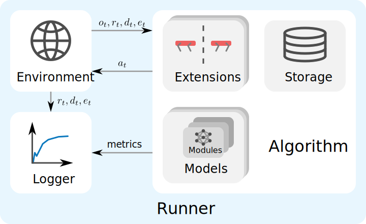
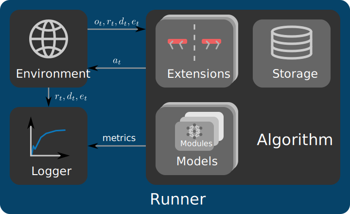

Overview
========

This guide provides an overview of the features and structure of RSL-RL. After introducing the currently available
:ref:`features <library-features>`, we explain the :ref:`core components <core-components>` and 
:ref:`additional components <additional-components>` of the library. Finally, we provide a 
:ref:`minimal example <example-integration>` of how to integrate RSL-RL into a project.

.. _library-features:

Library Features
----------------

RSL-RL is intentionally kept minimal and focuses on a small set of components that cover common robotics workflows while
remaining easy to adapt. The following sections summarize the main features currently available.

Algorithms
^^^^^^^^^^

:class:`~rsl_rl.algorithms.ppo.PPO`
   PPO is a model-free, on-policy RL algorithm for continuous control. In each iteration, the algorithm collects
   rollouts, computes GAE-based return targets, and optimizes actor and critic losses over multiple mini-batches. The
   implementation includes clipped surrogate and value losses, entropy regularization, gradient clipping, and optional
   adaptive learning-rate scheduling based on the observed KL divergence.

:class:`~rsl_rl.algorithms.distillation.Distillation`
   Distillation is a student-teacher behavior cloning algorithm. During data collection, the student acts while the
   teacher provides supervision targets. The student is then optimized with a configurable behavior loss, making this 
   algorithm useful for transferring policies from training-time privileged observation sets to observations available
   during real-world deployment.

Models
^^^^^^

:class:`~rsl_rl.models.mlp_model.MLPModel`
   A feed-forward baseline model for actor, critic, student, or teacher networks. It concatenates selected observation
   groups, optionally normalizes them, processes them through an MLP, and optionally maps outputs through a stochastic
   action distribution.

:class:`~rsl_rl.models.rnn_model.RNNModel`
   A recurrent extension of the :class:`~rsl_rl.models.mlp_model.MLPModel` for partially observable settings. The 
   recurrent network can be either a Long Short-Term Memory (LSTM) or a Gated Recurrent Unit (GRU). Its output is passed
   through the MLP to produce the final output.

:class:`~rsl_rl.models.cnn_model.CNNModel`
   A model for mixed 1D + 2D observations. It combines an MLP pathway for 1D observations with one or more CNN encoders 
   for 2D observations. Each 2D observation group is encoded with a separate CNN encoder that can be configured 
   independently. When used in conjunction with :class:`~rsl_rl.algorithms.ppo.PPO`, the encoders may be shared between
   actor and critic to save memory.

Distributions
^^^^^^^^^^^^^

:class:`~rsl_rl.modules.distribution.GaussianDistribution`
   A diagonal Gaussian distribution with state-independent standard deviation parameters. The mean is produced by the
   model's MLP network output, while the standard deviation is learned globally and can use either a scalar or a 
   log-scale.

:class:`~rsl_rl.modules.distribution.HeteroscedasticGaussianDistribution`
   A diagonal Gaussian distribution with state-dependent standard deviation. The model's MLP network predicts both mean 
   and standard-deviation terms per sample, allowing uncertainty to vary with the observation. As with the standard
   Gaussian variant, both scalar and log-scale parameterizations are supported.

Extensions
^^^^^^^^^^

:class:`~rsl_rl.extensions.rnd.RandomNetworkDistillation`
   Random Network Distillation (RND) adds an intrinsic reward based on the prediction error between a trainable
   predictor network and a fixed target network. The implementation supports selecting dedicated observation groups for
   curiosity, optional state and reward normalization, and configurable weight schedules for annealing the intrinsic
   reward contribution over the training. This extension is compatible with the :class:`~rsl_rl.algorithms.ppo.PPO`
   algorithm.

Symmetry
   Symmetry augments the collected environment interaction data with mirrored data using a user-provided symmetry 
   function that defines how observations and actions are transformed. This can improve sample efficiency and promote
   symmetric behaviors for robots with structured morphology. Additionally, a mirror-loss regularization term can be
   added to the loss function to actively encourage symmetry in the policy. This extension is compatible with the
   :class:`~rsl_rl.algorithms.ppo.PPO` algorithm.

Loggers
^^^^^^^

TensorBoard
   The default local logging backend for scalar metrics.

Weights & Biases
   Cloud-based experiment tracking with support for remote monitoring and model uploads.

Neptune
   A cloud-based experiment tracking alternative to W&B.

All logging backends are accessed through a common logger interface, and can be used with both single-GPU and
distributed multi-GPU training workflows.

.. _core-components:

Core Components
---------------

RSL-RL consists of four core components: :doc:`Runners <../api/runners>`, :doc:`Algorithms <../api/algorithms>`,
:doc:`Models <../api/models>`, and :doc:`Modules <../api/modules>`, implementing the learning loop, algorithmic logic, 
and neural network architectures. In conjunction with the library's additional components:
:doc:`Environment <../api/env>`, :doc:`Storage <../api/storage>`, :doc:`Extensions <../api/extensions>`, and
:doc:`Utils <../api/utils>`, described in the next section, they form a complete learning pipeline.

.. note::
   In the following, functions are linked to implementations for a standard :class:`~rsl_rl.algorithms.ppo.PPO` training
   pipeline. Other learning pipelines may have different implementations of these functions.

Runners
^^^^^^^
The **Runner** implements the main learning loop in :func:`~rsl_rl.runners.on_policy_runner.OnPolicyRunner.learn` and
coordinates the interaction with the **Environment**. It is the main API of the library, providing functionality for
saving, loading, and exporting checkpoints and models via :func:`~rsl_rl.runners.on_policy_runner.OnPolicyRunner.save`,
:func:`~rsl_rl.runners.on_policy_runner.OnPolicyRunner.load`,
:func:`~rsl_rl.runners.on_policy_runner.OnPolicyRunner.export_policy_to_jit`,
and :func:`~rsl_rl.runners.on_policy_runner.OnPolicyRunner.export_policy_to_onnx`. Additionally, it coordinates the
initialization of the multi-GPU pipeline, the **Algorithm**, and the :class:`~rsl_rl.utils.logger.Logger`.

Algorithms
^^^^^^^^^^
The **Algorithm** implements the logic of the core learning process. It is responsible for acting on the observations
provided by the **Environment** in :func:`~rsl_rl.algorithms.ppo.PPO.act`, processing data collected from the
environment interaction in :func:`~rsl_rl.algorithms.ppo.PPO.process_env_step`, and updating the parameters of the
learnable **Model** instances in :func:`~rsl_rl.algorithms.ppo.PPO.update`. The **Algorithm** can make use of a
**Storage** instance to store collected environment interaction data. The **Algorithm** manages one or more **Model**
instances and possibly algorithmic **Extensions**, which are initialized in
:func:`~rsl_rl.algorithms.ppo.PPO.construct_algorithm`.

Models
^^^^^^
The **Model** implements a neural network that is used by the **Algorithm** for different purposes. For example,
:class:`~rsl_rl.algorithms.ppo.PPO` uses **Model** instances for the actor and critic networks, while
:class:`~rsl_rl.algorithms.distillation.Distillation` uses **Model** instances for the student and teacher networks. The
:func:`~rsl_rl.models.mlp_model.MLPModel.forward` pass of a **Model** instance consists of three steps:

1. A latent is computed from raw observations in :func:`~rsl_rl.models.mlp_model.MLPModel.get_latent`. This may involve
   normalization, recurrent processing for :class:`~rsl_rl.models.rnn_model.RNNModel` instances, or convolutional
   encoding for :class:`~rsl_rl.models.cnn_model.CNNModel` instances.
2. The latent is passed to a Multi-Layer Perceptron (MLP).
3. The output of the MLP is either returned as is or used to sample from a
   :class:`~rsl_rl.modules.distribution.Distribution`, in case stochastic outputs are requested.

The **Model** acts as a unified interface for the **Algorithm** and coordinates all **Module** instances needed to
implement a certain network architecture.

Modules
^^^^^^^
A **Module** implements a building block for the **Model**. This could be a neural network, such as the
:class:`~rsl_rl.modules.mlp.MLP`, a normalizer, such as
:class:`~rsl_rl.modules.normalization.EmpiricalNormalization`, or a distribution, such as the
:class:`~rsl_rl.modules.distribution.GaussianDistribution`. Modules are initialized in the **Model** constructor and
managed by the **Model**.

.. _additional-components:

Additional Components
---------------------

Additional Components support the core components by either defining interfaces, adding optional functionality, or 
providing utilities, such as data storage or logging.

Environment
^^^^^^^^^^^
The **Environment** implements an abstract interface that is used by the **Runner** to interact with the environment.
Next to some required attributes, the **Environment** must implement the :func:`~rsl_rl.env.vec_env.VecEnv.step`
and :func:`~rsl_rl.env.vec_env.VecEnv.get_observations` methods.

Storage
^^^^^^^
The **Storage** implements a storage buffer that is used by the **Algorithm** to store collected environment interaction
data. It returns the data to the **Algorithm** for its :func:`~rsl_rl.algorithms.ppo.PPO.update` in a suitable format,
for example in mini-batches.

Extensions
^^^^^^^^^^
An **Extension** implements an augmentation to a specific **Algorithm** to modify its behavior. Currently, RSL-RL does 
not constrain the way an **Extension** may be implemented, allowing for arbitrary modifications to the learning process.

Utils
^^^^^
**Utils** include various helpers for the library, such as a :class:`~rsl_rl.utils.logger.Logger` to record the learning
process, or functions to resolve configuration settings.

.. _example-integration:

Example Integration
-------------------

The following example shows a simple training script which 1) creates an environment, 2) loads a YAML configuration, 3)
initializes an :class:`~rsl_rl.runners.on_policy_runner.OnPolicyRunner`, 4) runs the training, and 5) exports the
trained policy for deployment. The environment is defined by the user and must implement the
:class:`~rsl_rl.env.vec_env.VecEnv` interface. The configuration setup is described in the
:doc:`configuration guide <configuration>`.

.. code-block:: python

   import yaml

   from rsl_rl.runners import OnPolicyRunner

   # 1) Create your environment (usually provided by environment libraries such as Isaac Lab)
   env = make_env()

   # 2) Load a YAML configuration and extract the configuration dictionary expected by RSL-RL
   with open("config/my_training.yaml", "r", encoding="utf-8") as f:
       full_cfg = yaml.safe_load(f)
   train_cfg = full_cfg["runner"]

   # 3) Build the runner
   runner = OnPolicyRunner(
       env=env,
       train_cfg=train_cfg,
       log_dir="logs/my_experiment", # Directory for saving checkpoints and logs
       device="cuda:0", # Device to run the training on
   )

   # 4) Start training
   runner.learn(num_learning_iterations=1500) # Specify the number of desired iterations

   # 5) Export the trained policy for deployment
   runner.export_policy_to_jit("logs/my_experiment/exported", filename="policy.pt")
   runner.export_policy_to_onnx("logs/my_experiment/exported", filename="policy.onnx")

A trained policy can later be loaded to continue a previous training or to be replayed for evaluation as in the
following replay script:

.. code-block:: python

   import yaml

   from rsl_rl.runners import OnPolicyRunner

   # 1) Create your environment (usually provided by environment libraries such as Isaac Lab)
   env = make_env()

   # 2) Load the YAML configuration used during training
   with open("config/my_training.yaml", "r", encoding="utf-8") as f:
       full_cfg = yaml.safe_load(f)
   train_cfg = full_cfg["runner"]

   # 3) Build the runner
   runner = OnPolicyRunner(
       env=env,
       train_cfg=train_cfg,
       device="cuda:0",
   )

   # 4) Load the trained policy
   runner.load("logs/my_experiment/model_1499.pt")

   # 5) Get the inference policy
   policy = runner.get_inference_policy()

   # 6) Run the policy in the environment for 1000 steps
   obs = env.get_observations()
   for _ in range(1000):
       actions = policy(obs)
       obs, rewards, dones, extras = env.step(actions)